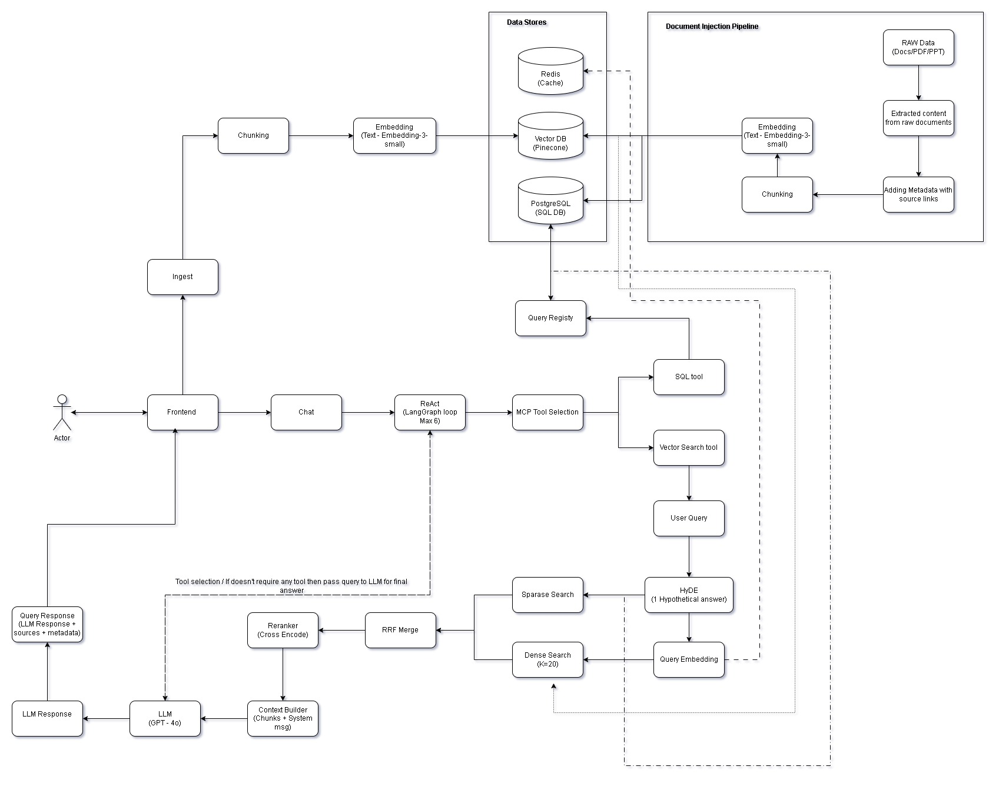

# Agentic RAG System

An end-to-end Retrieval-Augmented Generation system built with LangChain, LangGraph, and FastMCP. It combines a ReAct agent loop with hybrid search (dense + sparse), HyDE query expansion, Reciprocal Rank Fusion, and cross-encoder reranking to deliver grounded, accurate answers from both a knowledge base and a product catalog.

## Architecture



### How It Works

1. **User Query** arrives through the frontend chat interface or the REST API.

2. **ReAct Agent (LangGraph)** receives the query and decides which tool to call. The agent loops up to 6 iterations, selecting between `vector_search` and `sql_lookup` based on the question.

3. **MCP Tool Selection** routes the call to the appropriate tool implementation via the Model Context Protocol.

4. **Vector Search Tool** triggers the full RAG pipeline:
   - **HyDE** generates a hypothetical answer passage and embeds it instead of the raw query, improving recall.
   - **Query Embedding** converts the HyDE output into a 1024-dim vector using `text-embedding-3-small`.
   - **Dense Search** retrieves top-k documents from Pinecone (cosine similarity).
   - **Sparse Search** runs keyword matching against PostgreSQL (tsvector) or SQLite (LIKE in dev mode).
   - **RRF Merge** combines dense and sparse results using Reciprocal Rank Fusion.
   - **Cross-Encoder Reranker** scores every candidate with `cross-encoder/ms-marco-MiniLM-L-6-v2` and selects the top 5.

5. **SQL Tool** executes pre-registered parameterized queries against the product catalog (no raw SQL injection).

6. **LLM Response** — GPT-4o synthesizes the final answer grounded in the retrieved context, citing sources.

7. **Query Response** is returned to the user with the answer, source documents, tool call trace, and latency metrics.

### Data Stores

| Store | Purpose |
|-------|---------|
| **Pinecone** | Dense vector index for semantic search |
| **PostgreSQL / SQLite** | Sparse keyword search (tsvector), product catalog, session storage |
| **Redis** | Embedding cache and Celery task queue (production) |

## Project Structure

```
.
├── app/
│   ├── main.py                  # FastAPI application and endpoints
│   ├── logging_config.py        # Structlog setup
│   ├── services/
│   │   ├── agent.py             # LangGraph ReAct agent
│   │   ├── rag_pipeline.py      # HyDE + multi-query + retrieval orchestration
│   │   ├── retriever.py         # Hybrid retriever (dense + sparse + RRF + rerank)
│   │   ├── reranker.py          # Cross-encoder reranker
│   │   ├── vectordb.py          # Pinecone vector store
│   │   ├── embeddings.py        # OpenAI embeddings
│   │   └── cache.py             # Redis / in-memory cache
│   ├── mcp/
│   │   ├── server.py            # FastMCP server (SSE + STDIO)
│   │   ├── tools.py             # Tool implementations + SQL query registry
│   │   └── context.py           # Session context manager
│   ├── models/
│   │   ├── database.py          # SQLAlchemy models and engine
│   │   └── schemas.py           # Pydantic request/response schemas
│   ├── ingestion/
│   │   ├── pipeline.py          # Document ingestion pipeline
│   │   ├── chunking.py          # Parent-child chunking with LangChain
│   │   └── tasks.py             # Celery async tasks
│   ├── evaluation/
│   │   └── metrics.py           # Agent performance metrics
│   └── utils/
│       └── log_utils.py         # stderr logging helper
├── config/
│   └── settings.py              # Pydantic settings (loaded from .env)
├── frontend/
│   └── index.html               # Chat UI (Tailwind CSS)
├── injection/
│   ├── 01_extract_text.ipynb    # Extract text from PDFs and DOCX files
│   ├── 02_chunking.ipynb        # Parent-child chunking strategy
│   ├── 03_embedding.ipynb       # Generate embeddings with OpenAI
│   ├── 04_inject_pinecone.ipynb # Upsert vectors into Pinecone
│   └── 05_inject_sql.ipynb      # Insert parent chunks into SQL for sparse search
├── test/
│   └── mcp_server.py            # Standalone MCP server for Inspector testing
├── .env.example                 # Environment variable template
├── requirements.txt             # Python dependencies
├── run_app.sh                   # Start the FastAPI server
└── mcp.sh                       # Launch MCP Inspector
```

## Getting Started

### Prerequisites

- Python 3.11+
- OpenAI API key
- Pinecone API key and index

### Installation

```bash
git clone https://github.com/srinivas600/agentic-rag-system.git
cd agentic-rag-system

python -m venv venv
# Windows
venv\Scripts\activate
# Linux / macOS
source venv/bin/activate

pip install -r requirements.txt
```

### Configuration

Copy the example env file and fill in your keys:

```bash
cp .env.example .env
```

Key variables:

| Variable | Description |
|----------|-------------|
| `OPENAI_API_KEY` | OpenAI API key for GPT-4o and embeddings |
| `OPENAI_EMBEDDING_DIM` | Embedding dimensions (must match Pinecone index, e.g. `1024`) |
| `PINECONE_API_KEY` | Pinecone API key |
| `PINECONE_INDEX_NAME` | Name of your Pinecone index |
| `DEV_MODE` | Set to `true` to use SQLite + in-memory cache (no PostgreSQL/Redis needed) |

### Data Injection

Run the Jupyter notebooks in the `injection/` folder in order:

1. **01_extract_text.ipynb** — Extract text from raw PDF/DOCX files
2. **02_chunking.ipynb** — Split into parent and child chunks using LangChain's `RecursiveCharacterTextSplitter`
3. **03_embedding.ipynb** — Generate embeddings with `text-embedding-3-small`
4. **04_inject_pinecone.ipynb** — Upsert child chunk embeddings into Pinecone
5. **05_inject_sql.ipynb** — Insert parent chunks into SQL for sparse keyword search

### Running the Application

**FastAPI server:**

```bash
# Windows
venv\Scripts\python.exe -m uvicorn app.main:app --host 0.0.0.0 --port 8000 --reload

# Linux / macOS
python -m uvicorn app.main:app --host 0.0.0.0 --port 8000 --reload
```

The frontend is served at `http://localhost:8000` and the API docs at `http://localhost:8000/docs`.

**MCP Inspector (for testing tools):**

```bash
npx @modelcontextprotocol/inspector -- venv/Scripts/python.exe test/mcp_server.py
```

## API Endpoints

| Method | Path | Description |
|--------|------|-------------|
| `POST` | `/query` | Send a query to the ReAct agent |
| `POST` | `/query/stream` | Stream agent response as SSE |
| `POST` | `/search` | Direct RAG retrieval without agent loop |
| `POST` | `/ingest` | Ingest a document (async via Celery in prod) |
| `POST` | `/ingest/sync` | Synchronous document ingestion |
| `GET`  | `/health` | Health check for all services |
| `GET`  | `/metrics` | Aggregated system metrics |
| `POST` | `/mcp/dispatch` | Dispatch an MCP tool call |
| `GET`  | `/mcp/tools` | List available MCP tools for a role |

## MCP Tools

| Tool | Description |
|------|-------------|
| `vector_search` | Semantic search with HyDE, hybrid retrieval, and cross-encoder reranking |
| `sql_lookup` | Parameterized SQL queries against the product catalog |
| `code_interpreter` | Execute Python code in a sandbox |
| `get_session_context` | Retrieve shared session context |
| `update_session_context` | Update session context with new data |

### SQL Lookup Queries

| Query Name | Parameters | Description |
|------------|------------|-------------|
| `all_products` | none | All products |
| `products_by_category` | `category` | Filter by category (Electronics, Software, Books, Cloud, Office) |
| `products_by_price` | `max_price` | Products under a price |
| `products_by_price_category` | `category`, `max_price` | Category + price filter |
| `product_search` | `pattern` | Search by name with SQL wildcards (`%keyword%`) |
| `product_by_id` | `id` | Single product by UUID |
| `recent_sessions` | none | Recent agent sessions |

## Chunking Strategy

The system uses a **hierarchical parent-child chunking** approach:

- **Parent chunks** (~1024 tokens) are stored in SQL for sparse keyword retrieval and provide full context to the LLM.
- **Child chunks** (~256 tokens) are embedded and stored in Pinecone for precise semantic matching.

When a child chunk matches a query, the system retrieves its parent chunk to give the LLM richer context. This small-to-big strategy improves both retrieval precision and answer quality.

## Tech Stack

| Component | Technology |
|-----------|------------|
| LLM | GPT-4o |
| Embeddings | text-embedding-3-small (1024 dims) |
| Agent Framework | LangGraph (ReAct pattern) |
| Vector Store | Pinecone (Serverless, cosine) |
| Sparse Search | PostgreSQL tsvector / SQLite LIKE |
| Reranker | cross-encoder/ms-marco-MiniLM-L-6-v2 |
| API | FastAPI + Uvicorn |
| MCP | FastMCP (SSE + STDIO) |
| Task Queue | Celery + Redis |
| Observability | LangSmith + structlog |
| Frontend | Tailwind CSS + vanilla JS |
